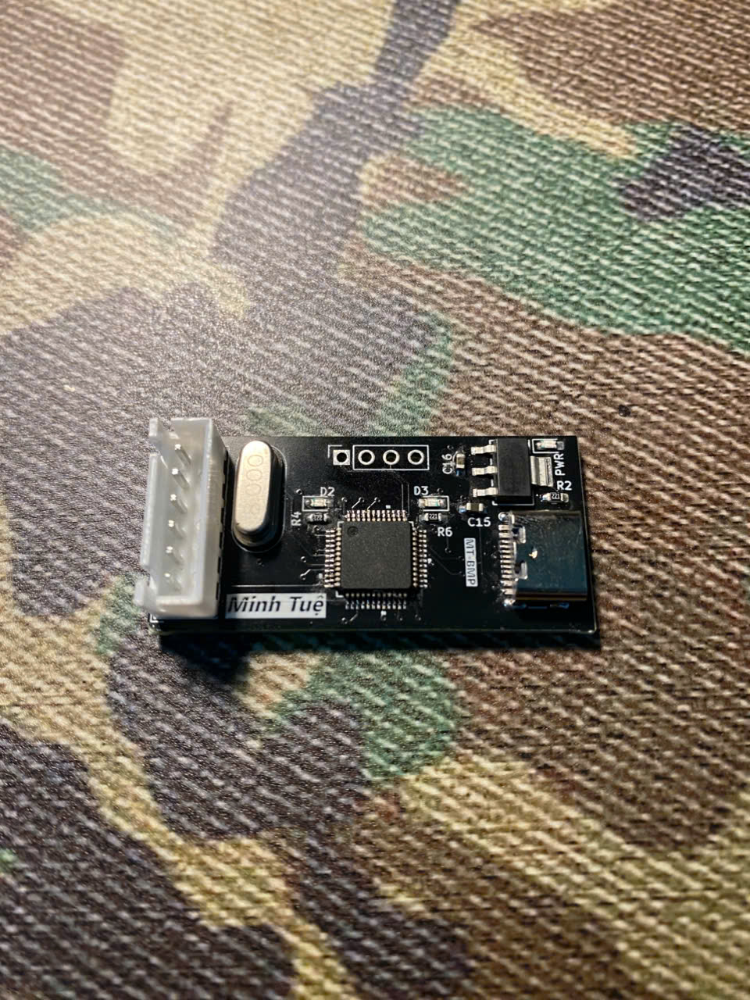
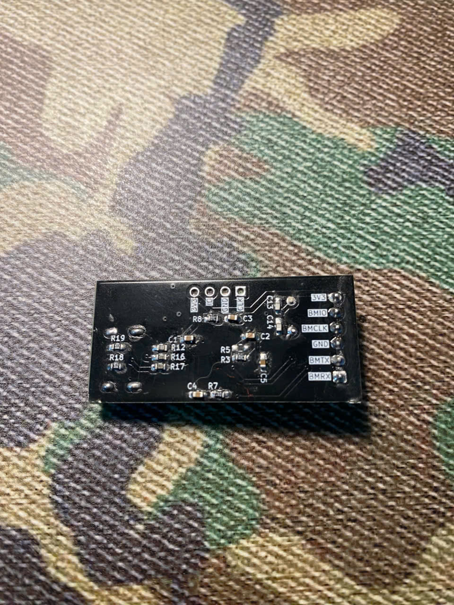

# 🚀 How to Load Firmware into STM32F103C8T6 (Bluepill)

This guide provides detailed instructions for loading Blackmagic firmware onto the Bluepill board using either an ST-Link or Black Magic Probe (BMP).


<table align="center">
  <tr>
    <th>Front</th>
    <th>Back</th>
  </tr>
  <tr>
    <td></td>
    <td></td>
  </tr>
</table>


---

## 📂 1. Prepare the Firmware Files
Locate the following files in your build directory:
- `.../blackmagic-firmware-v1.10.2/bluepill/blackmagic_dfu-bluepill.elf`
- `.../blackmagic-firmware-v1.10.2/bluepill/blackmagic-bluepill.elf`

---

## 🛠️ 2. Install GDB Tool
Open **PowerShell** or **Terminal** and run the following command:
```bash
arm-none-eabi-gdb
```

> **Tip:**
> If GDB is not installed, you can use the version included with PlatformIO by running:
> ```powershell
> # Check the path
> dir $env:USERPROFILE\.platformio\packages\toolchain-gccarmnoneeabi\bin
>
> # Run GDB directly
> & "$env:USERPROFILE\.platformio\packages\toolchain-gccarmnoneeabi\bin\arm-none-eabi-gdb.exe"
> ```

---

## ⚡ 3. Flash the Firmware

Choose your preferred flashing method:

### 🔹 Method A: Using ST-LINK
Use the `st-flash` tool to flash the firmware via the SWD interface:
```bash
# Erase old memory
st-flash erase

# Flash the DFU Bootloader (at address 0x8000000)
st-flash --flash=0x20000 write .../blackmagic-firmware-v1.10.2/bluepill/blackmagic_dfu-bluepill.elf 0x8000000

# Flash the main firmware (at address 0x8002000) and reset
st-flash --flash=0x20000 --reset write .../blackmagic-firmware-v1.10.2/bluepill/blackmagic-bluepill.elf 0x8002000
```

### 🔹 Method B: Using Black Magic Probe (BMP)
Run GDB and execute the following commands:
```bash
# Connect to BMP (replace COMx with the appropriate port)
target extended-remote COMx           # For Windows
target extended-remote /dev/tty*      # For Linux

monitor swdp_scan
attach 1
monitor halt
monitor erase_mass

# Flash the DFU Bootloader
file .../blackmagic-firmware-v1.10.2/bluepill/blackmagic_dfu-bluepill.elf
load

# Flash the main firmware
file .../blackmagic-firmware-v1.10.2/bluepill/blackmagic-bluepill.elf
load

monitor reset
continue
```

---

## 🧠 Important Notes

### Flash Memory Addresses
- The `.elf` files usually contain the address information, so manual specification is often unnecessary.
- STM32F103 Flash starts at `0x08000000`.
  - **DFU Bootloader:** Typically occupies the first 8KB (`0x08000000 → 0x08002000`).

### ✅ Result
After successfully flashing, disconnect and reconnect the board to your PC via USB. If successful, your computer will detect two Virtual COM ports:
1. **GDB Port**
2. **UART Port**

Congratulations! Enjoy your new Blackmagic Probe! 🎉

---

## 📞 Quick Troubleshooting

| **Error**               | **Cause**                  | **Solution**                          |
|-------------------------|----------------------------|---------------------------------------|
| `unknown architecture "arm"` | Incorrect GDB version      | Use the correct `arm-none-eabi-gdb`. |
| `load failed`           | Memory not erased          | Run `monitor erase_mass` before loading. |
| `attach` error          | Physical connection issue  | Check the `monitor swdp_scan` command. |
| Target not detected     | Loose or incorrect SWD wires | Verify SWDIO and SWCLK connections.  |

